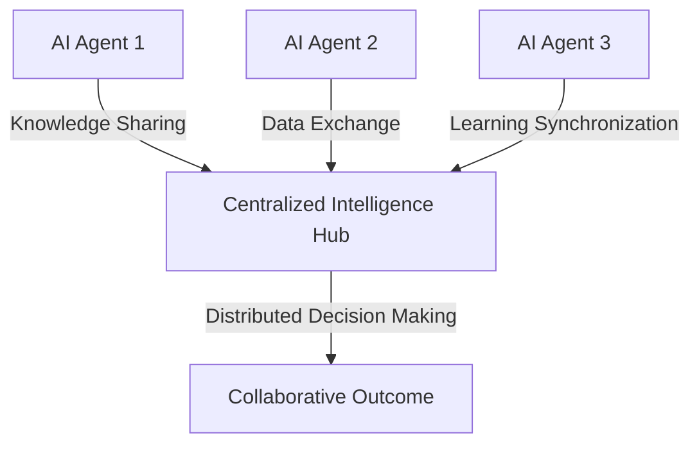
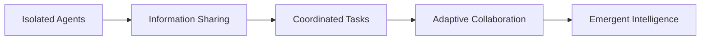

I'll provide a comprehensive analysis of AI agent collaboration.

## AI Agent Collaboration Framework

### Collaboration Architectures

1. **Collective Intelligence Models**

2. **Multi-Agent System Interaction**
- **Cooperative Strategies**
  * Task Decomposition
  * Distributed Problem Solving
  * Negotiation Protocols
  * Resource Allocation

### Collaboration Mechanisms

| Collaboration Type | Description | Complexity | Key Characteristics |
|-------------------|-------------|------------|---------------------|
| **Parallel Processing** | Simultaneous task execution | Low | - Independent task handling - Minimal interdependence - Quick result aggregation |
| **Sequential Collaboration** | Staged problem-solving | Medium | - Handoff between agents - Specialized skill utilization - Staged information transfer |
| **Negotiation-Based** | Dynamic role assignment | High | - Adaptive task allocation - Conflict resolution - Complex decision-making |
| **Emergent Collaboration** | Self-organizing systems | Highest | - Adaptive learning - Contextual intelligence - Autonomous coordination |

### Technical Collaboration Approaches

1. **Communication Protocols**
   - Standardized message formats
   - Semantic understanding
   - Context-aware information exchange
   - Real-time synchronization

2. **Knowledge Representation**
   - Shared ontologies
   - Distributed knowledge graphs
   - Incremental learning models
   - Consensus mechanisms

3. **Decision-Making Frameworks**
   - Collaborative optimization
   - Probabilistic reasoning
   - Multi-objective problem solving
   - Distributed consensus algorithms

## Collaboration Challenges

### Technical Limitations
- **Semantic Interoperability**
  * Different training backgrounds
  * Varied interpretation models
  * Communication noise

- **Trust Mechanisms**
  * Verification of agent intentions
  * Credibility assessment
  * Error propagation management

### Collaboration Dimensions

| Dimension | Description | Implementation Complexity |
|-----------|-------------|----------------------------|
| **Information Sharing** | Basic data exchange | Low |
| **Task Coordination** | Collaborative problem solving | Medium |
| **Adaptive Learning** | Mutual skill enhancement | High |
| **Emergent Intelligence** | Self-organizing systems | Highest |

## Collaborative Intelligence Spectrum

### Practical Implementation Strategies

1. **Standardized Agent Interfaces**
   - Common communication protocols
   - Modular design
   - Interchangeable components

2. **Collaborative Learning**
   - Shared training datasets
   - Cross-agent knowledge transfer
   - Federated learning models

3. **Ethical Collaboration Frameworks**
   - Transparent decision-making
   - Bias detection
   - Accountability mechanisms

## Real-World Collaboration Scenarios

### 1. Scientific Research
- **Collaborative Domains**
  * Complex simulation modeling
  * Data analysis
  * Hypothesis generation
  * Predictive research

### 2. Engineering Problem Solving
- **Application Areas**
  * Distributed optimization
  * Design iteration
  * Constraint satisfaction
  * Multi-objective engineering

### 3. Healthcare Diagnostics
- **Collaboration Mechanisms**
  * Symptom correlation
  * Cross-referencing medical databases
  * Diagnostic hypothesis generation
  * Treatment recommendation synthesis

## Emerging Technologies

1. **Quantum Multi-Agent Systems**
   - Superposition collaboration
   - Entangled decision-making
   - Probabilistic reasoning

2. **Neuromorphic Computing**
   - Brain-inspired collaboration
   - Adaptive learning networks
   - Context-aware interactions

## Recommended Research Directions

- Develop robust collaboration protocols
- Create universal agent communication standards
- Design ethical collaboration frameworks
- Explore emergent intelligence models

## Limitations and Considerations

- Current AI lacks true understanding
- Collaboration is fundamentally algorithmic
- Human oversight remains critical
- Continuous verification necessary

### Collaboration Readiness Checklist
- [ ] Standardized communication protocols
- [ ] Shared knowledge representation
- [ ] Conflict resolution mechanisms
- [ ] Ethical guidelines implementation
- [ ] Continuous learning framework
- [ ] Performance monitoring system